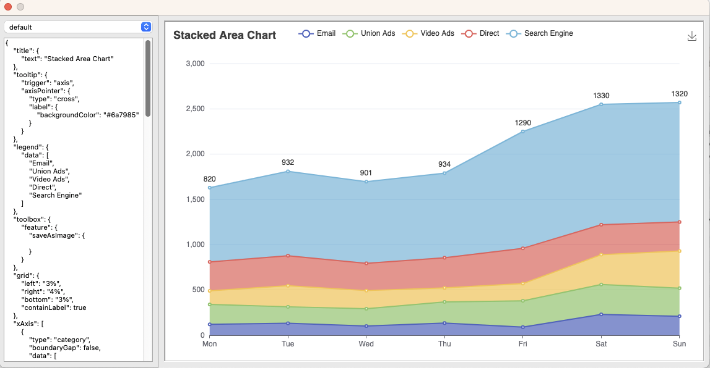

# Omnis eCharts

[Apache eCharts](https://echarts.apache.org/en/index.html) in Omnis

Cheatsheet: [https://echarts.apache.org/en/cheat-sheet.html](https://echarts.apache.org/en/cheat-sheet.html)


")

## Installation

Download `omnis-echarts.tar.gz` from Releases

### HTML Control (oBrowser)

Move `omnis-echarts` directory into Omnis Studio `htmlcontrols`, in the application package
([Docs](https://www.omnis.net/blog/add-web-functionality-to-omnis-studio-desktop-apps-with-obrowser/))

### JSON Control (Remote Form)

See [Docs](https://omnis.net/developers/resources/onlinedocs/index.jsp?detail=WebDev/04jsoncomps.html#json-control-editor)

Aside: `$OMNIS_HOME` is the user directory where Omnis stores it's local files.  It is a copy of the content in 
`firstruninstall` after the first run of Omnis.

Move:

* `ctrl_omnis_echarts/omnis_echarts` -> `$OMNIS_HOME/html/controls`
* `ctrl_omnis_echarts/ctrl_omnis_echarts.css` -> `$OMNIS_HOME/html/css/ctrl_omnis_echarts.css`
* `ctrl_omnis_echarts/ctrl_omnis_echarts.js` -> `$OMNIS_HOME/html/scripts/ctrl_omnis_echarts.js`

Move *Optionally*:

(The `.map` file enables nicer debugger, because the full source is available in the browser's Inspect panel)

* `ctrl_omnis_echarts/ctrl_omnis_echarts.js.map` -> `$OMNIS_HOME/html/scripts/ctrl_omnis_echarts.js.map`

Edit `$OMNIS_HOME/html/jsctempl.htm` to add:

```html
<!-- Omnis eCharts Styles -->
<link type="text/css" href="css/ctrl_omnis_echarts.css" rel="stylesheet" />
```

and

```html
<!-- Omnis eCharts JavaScript -->
<script type="text/javascript" crossorigin src="scripts/ctrl_omnis_echarts.js"></script>
```

to the CSS and JS sections, respectively.


### Properties

- `height`: Height, in `vh`, of the control within the pane. Default is 97% (full screen w/o scroll bar)
- `option`: JSON input to eCharts, as usage on eCharts examples
- `theme`: Theme to use for rendering the chart

### Events

- Downloads: Some eCharts show permit a file download. It's generally recommended to implement the file download
  capability in Omnis oBrowser to take advantage of this feature.

## Development

### Build HTML / CSS / Assets

```bash
npm run build
```

### dist

All output is placed into the `dist` folder:

* `omnis-echarts` as the oBrowser HTML Control
* `ctrl_omnis_echarts` as the Remote Form JSON Control

### Omnis Interaction

All interaction with Omnis is contained in the `index.html` entry point and the `stores/omnis.js` store.

### CORS Issues

Omnis Studio relies on [Chromium Embedded](https://bitbucket.org/chromiumembedded/cef/), which
respects normal file loading rules for disk content. This means that all code must be `base64`
encoded in order to avoid the CORS same-origin rules. The other solution is to manually configure
Chromium with switches like `--allow-file-access-from-files`, but that is both inconvenient and
insecure (switch is global, so it would affect regular HTTP loads in Omnis Studio as well)

To address this issue two plugins are used in the build:
[vite-plugin-singlefile](https://github.com/richardtallent/vite-plugin-singlefile) (inline of
JS/CSS) and [vite-plugin-html](https://github.com/vbenjs/vite-plugin-html) for minification.
